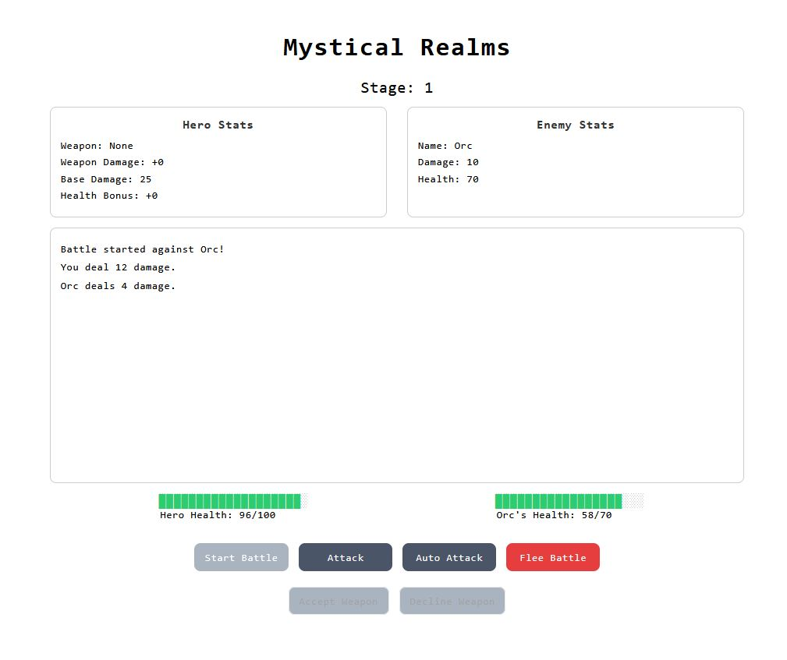

# Mystical Realms ⚔

Welcome to Mystical Realms, an exciting text-based RPG game written in Python using Object-Oriented Programming (OOP) principles. The game is now a full-stack Python Flask app, providing a more dynamic and interactive experience.

## Getting Started

To run the game, you need to have Python installed on your system.

1. Clone the repository:

```bash
git clone https://github.com/vincentpalomo/rpg-oop-python
```

2. Navigate to the project directory:

```
cd your-repository/0.0.3
```

3. Run the game:

```
python main.py
```

## Gameplay

- Your hero will face off against various enemies in a battle. 
- Defeat enemies to progress through stages and earn loot.
- Choose whether to equip the obtained loot or continue the journey without it.

> [!NOTE]
> Game is currently a Work In Progress and some features have not been implemented yet.

## Code Structure

The game is organized into three main classes:

- **Hero**: Represents the player character.
- **Enemy**: Represents the adversaries your hero will face.
- **GameLoop**: Manages the game flow, including battles and progression.

## Mobile Improvements

Recent updates have focused on enhancing the mobile experience:

- The layout has been adjusted to fit within a 414px x 796px viewport.
- All elements are centered, providing a more user-friendly interface.
- Padding for hero and enemy stats containers has been reduced for a more compact design.
- The height of the game output has been set to 20vh to ensure better visibility on mobile devices.

## Full-Stack Features

- The game is now built as a full-stack application using Flask, allowing for a more interactive and dynamic gameplay experience.
- Server-side logic is handled with Flask, enabling features like user sessions, data persistence, and more.

Feel free to explore and modify the code according to your preferences and creativity!

## Dependencies

The game has no external dependencies. Simply run it with a Python interpreter.

## Contributing

If you have suggestions, improvements, or bug fixes, feel free to contribute by creating a pull request. Your contributions are highly appreciated!

`images`

---

<p align='center'>



</p>

`note for future improvements`

> - version 0.0.3
> - add images for the readme
> - add stage number
> - add different kinds of enemies
> - implement yes or no prompt
> - update stats for all types of enemies
> - set enemy levels - beginner - intermediate - hard - boss

> - version 0.0.4
> - implement flee mechanic
> - option to select dropped loot from enemies
> - implement a beginner item select
> - implement potions for health boost or damage boost
> - implement a block mechanic [maybe for future major update]
> - implement a hero select

<!-- > - https://github.com/kamik423/cutie  -->
