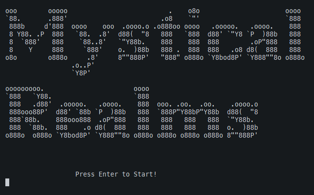
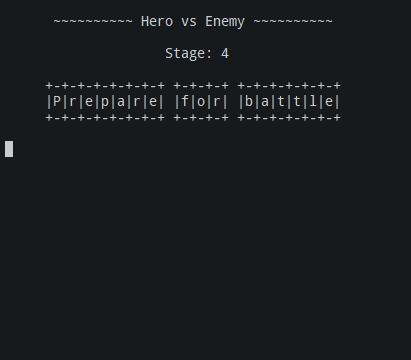
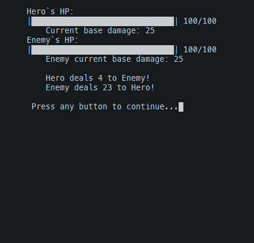
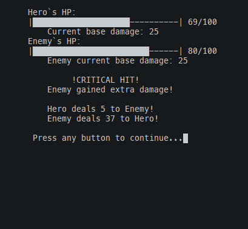
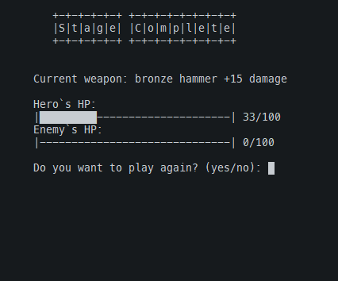
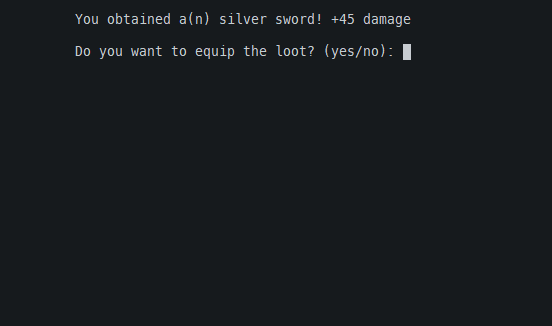
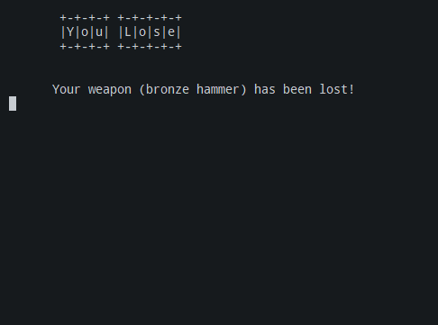

# Mystical Realms ⚔

Welcome to Mystical Realms, an exciting text-based RPG game written in Python using Object-Oriented Programming (OOP) principles.

## Getting Started

To run the game, you need to have Python installed on your system.

1. Clone the repository:

```bash
git clone https://github.com/vincentpalomo/rpg-oop-python
```

2. Navigate to the project directory:

```
cd your-repository/0.0.3
```

3. Run the game:

```
python main.py
```

Gameplay

- Your hero will face off against ~various~ enemies in a battle of ~strategy and strength~.
- Defeat enemies to progress through stages and earn loot.
- Choose whether to equip the obtained loot or continue the journey without it.

> [!NOTE]
> Game is currently a Work In Progress and some features have not been implemented yet.

Code Structure

The game is organized into three main classes:

    Hero: Represents the player character.
    Enemy: Represents the adversaries your hero will face.
    GameLoop: Manages the game flow, including battles and progression.

Feel free to explore and modify the code according to your preferences and creativity!

Dependencies

The game has no external dependencies. Simply run it with a Python interpreter.

Contributing

If you have suggestions, improvements, or bug fixes, feel free to contribute by creating a pull request. Your contributions are highly appreciated!

`images`

---

<!-- 





 -->

<p align='center'>
    
    
    
    
    
    
    
</p>

`note for future improvements`

> - version 0.0.3
> - add images for the readme
> - add stage number
> - add different kinds of enemies
